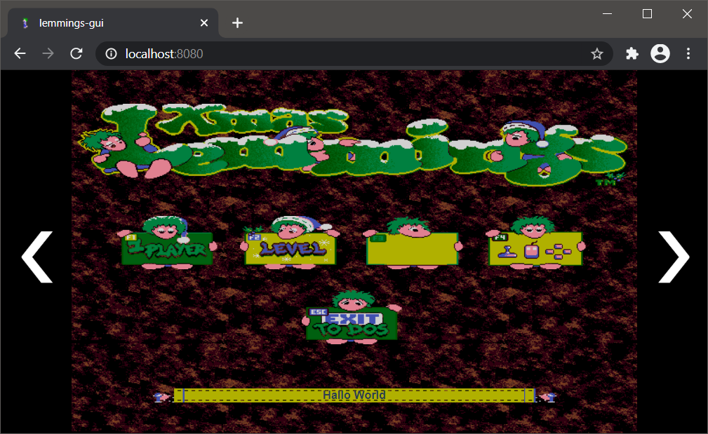
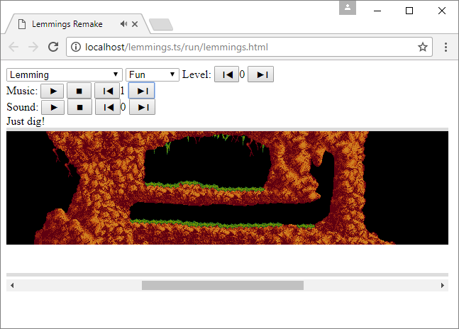
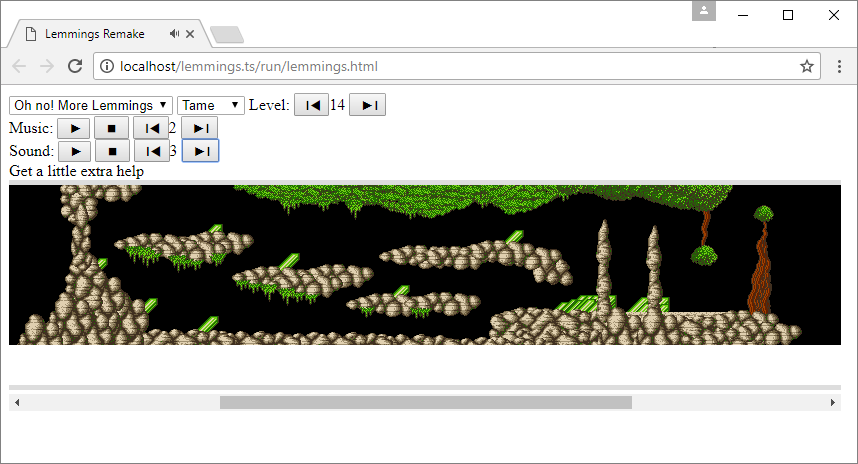

# Lemmings.ts
A Web Lemmings Clone/Remake in TypeScript - 🎉 Yes it's 100% JavaScript 🎉

<a href="http://lemmings.hmilch.net/">[play the game]</a>

## Feature
* Browser Game
* Support all variants of Lemmings Game
* Read original Lemmings binaries on the fly
* Support playing of original music by interpreting the adlib.dat file and using an Adlib emulator(s) (DosBox)

## ToDo
* fix some game issues
* touch support

## How to run
* download the *Lemmings.ts.zip* from [releases](https://github.com/tomsoftware/Lemmings.ts/releases)
* copy the original *Lemmings*, *OhNo* and *Holiday* binaries into the directory **run/{version}/**
* start *lemmings.html* - because of security restrictions you may need to call the lemmings.html via a webserver e.g. [nginx](https://www.nginx.com/)

## How to compile
the project uses VUE as UI Framework [VUE](https://vuejs.org/)
the game source can be found in `src\game`

* install [node.js](https://nodejs.org/en/download/)
* run `npm i` in a console to load package needed to build
* run `npm run build` in a console to build the web-app-game to `.\dist\` folder

## How to develop
* install [node.js](https://nodejs.org/en/download/)
* run `npm i` in a console to load package needed to build
* run `npm run dev` in *Visual Studio Code* to start the live-server

### How to debug using *Visual Studio Code*
* install [Visual Studio Code](https://code.visualstudio.com/)
* open project folder (root folder of the project) in *Visual Studio Code*
* press *Ctrl+Shift+B* to start the live-server
* use *F5* to run the debugger

## State

# Disclaimer
Disclaimer: This Project does not claim rights to any Lemmings Version. To the best of our/my knowledge, these titles have been discontinued by their publishers. If you know otherwise, please contact us/me and we will remove them accordingly. Thank you for your attention. See the LICENSE for more information.

## Standing on the shoulders of giants
Special thanks goes to:
- DMA for the original game
- Volker Oth, ccexplore and Mindless for their work on reverse engineering the Lemmings Level and Grafic Formats
- DosBox for there OPL emulator

