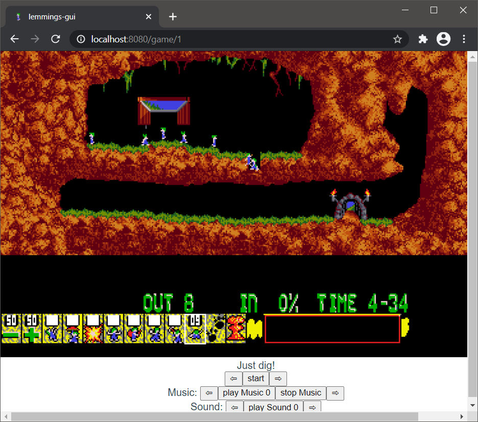

# Lemmings.ts
A Web Lemmings Clone/Remake in TypeScript

## Feature
* Browser Game
* Support all Versions of Lemmings
* Read original Lemmings Binarys
* Support Playing of original Music using a Browser Adlib Emulator

## ToDo
* You can not yet play the game. Only viewing the Levels
* Replace Adlib Emulator by DosBox version

## How to run
* download run folder
* copy the original *Lemmings*, *OhNo* and *Holiday* binarys in to the directory **run/{version}/**
* start *lemmings.html*

## How to compile
* you need Typescript to compile the code to JavaScript

## State

## Standing on the shoulders of giants
Special thanks goes to:
- DMA for the original game
- Volker Oth, ccexplore and Mindless for there work on reverse engineering the Lemmings Level and Grafic Formats
- Robson Cozendey for his Java OPL3 emulator